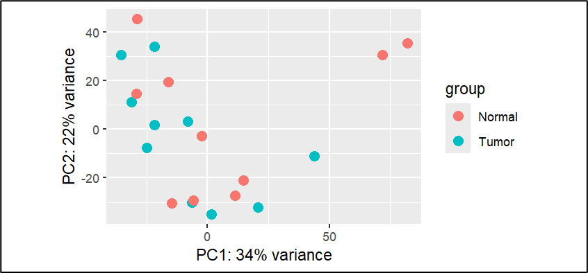

# Differential Gene Expression Analysis of Breast Cancer RNA-Seq Data for CAR-T Cell Therapy Targets

## Overview
This project identifies potential CAR-T cell therapy targets for breast cancer by analyzing RNA-Seq data from The Cancer Genome Atlas (TCGA). Using DESeq2 in R, we performed differential gene expression (DGE) analysis to find upregulated surface-expressed genes in tumor samples compared to normal tissues. The analysis revealed 28 significantly overexpressed genes, including **KIAA0319**, **CA9**, and **CEACAM6**, which are promising candidates for CAR-T therapy.

## Features
- Differential gene expression analysis using DESeq2
- Visualization of results with PCA, MA, Volcano, Heatmap, and Boxplot
- Identification of surface-expressed genes for CAR-T therapy targeting
- Reproducible pipeline using R and publicly available TCGA data

## Dataset
- **Source:** TCGA Breast Cancer RNA-Seq data (GDC Data Portal)
- **Samples:** 10 tumor and 10 normal samples
- **Data Format:** Gene-level raw count data (.tsv, STAR count)

## Installation
```bash
# Clone the repository
git clone https://github.com/Shouryanpatil/your-repo.git
cd your-repo

# Install R (version 4.3.2 or higher) and required packages
install.packages(c("DESeq2", "ggplot2", "pheatmap", "dplyr", "EnhancedVolcano"))

if (!require("BiocManager", quietly = TRUE))
    install.packages("BiocManager")
BiocManager::install("DESeq2")
```

## Usage
### 1. Download Data
- Obtain TCGA breast cancer RNA-Seq data from the GDC Data Portal.
- Place the `.tsv` files in a `data/` folder within the repository.

### 2. Prepare Metadata
- Create a metadata file (`metadata.csv`) classifying samples as `tumor` or `normal`.
- Example: `data/metadata_example.csv`

### 3. Run Analysis
```bash
Rscript scripts/dge_analysis.R
```
- Outputs (plots and tables) will be saved in the `results/` folder.

## Results
- **Differential Expression:** Identified 28 significantly upregulated genes  
  *(adjusted p-value < 3, log2 fold change > 7, baseMean > 10)*
- **Key Findings:**
  - KIAA0319 (log2FC: 3.03)
  - CA9 (log2FC: 3.21)
  - CEACAM6 (log2FC: 2.46)
- These genes are predicted or known surface proteins — ideal targets for CAR-T therapy.

### Visualizations
| Type        | Description                          | Image Path              |
|-------------|--------------------------------------|--------------------------|
| PCA Plot    | Separation of tumor and normal       | `images/pca.png`         |
| MA Plot     | Mean expression vs log fold change   | `images/ma.png`          |
| Volcano     | Statistically significant genes      | `images/volcano.png`     |
| Heatmap     | Expression of top DEGs               | `images/heatmap.png`     |
| Boxplot     | Expression of surface-expressed genes| `images/boxplot.png`     |

Use this Markdown syntax to embed:
```markdown

```

## Project Structure
```
your-repo/
├── data/                   # TCGA RNA-Seq data and metadata
│   └── sample_metadata.csv
├── images/                 # Visualization outputs
│   ├── pca.png
│   ├── ma.png
│   ├── volcano.png
│   ├── heatmap.png
│   └── boxplot.png
├── scripts/                # R scripts for analysis
│   └── dge_analysis.R
├── results/                # Output 
└── README.md               # This file
 
```

## Dependencies
- R (v4.3.2 or higher)
- R Packages:
  - DESeq2
  - ggplot2
  - pheatmap
  - dplyr
  - EnhancedVolcano

> See `requirements.txt` for a complete list

## Contributing
Contributions are welcome! Please open an issue or submit a pull request with improvements or bug fixes.

## License
MIT License

## References
1. Yang, Y. H., et al. (2022). *CAR-T Cell Therapy for Breast Cancer*. [DOI:10.7150/ijbs.70120](https://doi.org/10.7150/ijbs.70120)
2. Zhang, H., et al. (2022). *CAR-T Therapy in Breast Cancer*. [DOI:10.3389/fimmu.2022.887471](https://doi.org/10.3389/fimmu.2022.887471)
3. Schettini, F., et al. (2021). *Cell Surface Targets for CAR-T in Breast Cancer*. [DOI:10.1016/j.esmoop.2021.100102](https://doi.org/10.1016/j.esmoop.2021.100102)

## Contact
For questions, contact: **Shouryan Patil**  
📧 work.shouryan@gmail.com

